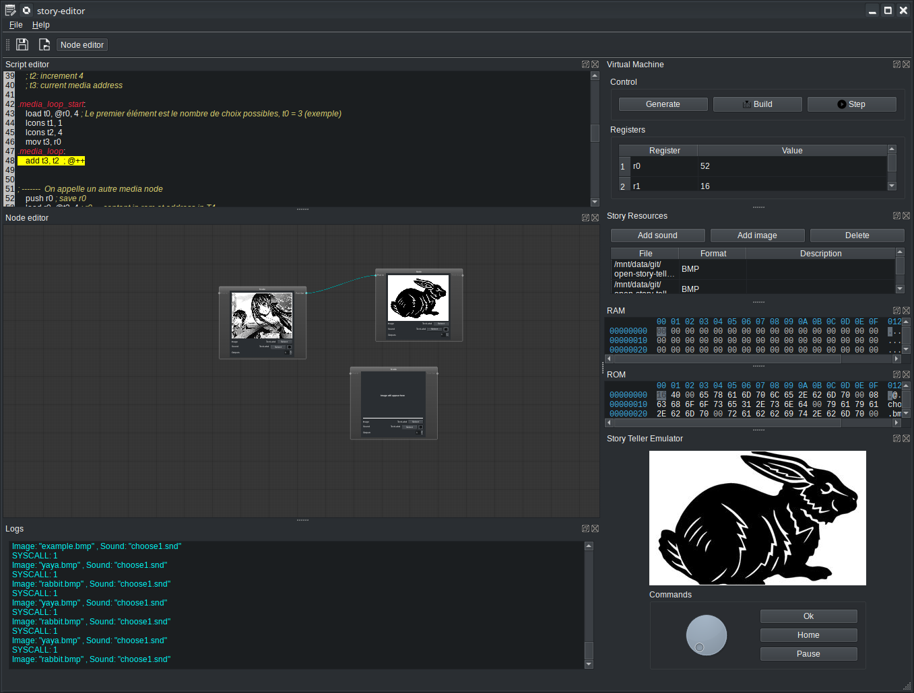

# Open Story Teller (OST)

Open Story Teller is an Open Source project to provide guidelines and software to build your own story teller box (electronics, mechanical).

The main goal is to *not* make electronics boards but instead buy or reuse existing ones. This will allow you to easily repair your device with spare parts.

We propose a set of parts and firmware that is working well together but your are free to custom everything to fit your needs.

This project can be used as a base platform for any device that is composed by:
- A display (TFT...)
- An Audio output
- A SD card or memory
- Some Buttons / rotary encoder / potentiometer

# Links

- http://openstoryteller.org/: main documentation, project news, guidelines, hardware shoping list...
- http://github.com/arabine/open-story-teller: source code, tickets, help

# Hardware parts

We propose the concept of bundles: a set of electronic boards that you can purchase quite easily (eg: Arduino, SeedStudio, Pimoroni, Adafruit, SparkFun...). The bundles are built around a central main board, the CPU, which comes with more or less peripherals (SD-Card reader, Wifi...).

Several bundles will be officially supported ; this is needed for us to ensure the portability of the firmware hardware interface layer.

Current bundles:
- Raspberry Pico (official DevKit) (ARM Cortex M0+)
- RISC-V based board (GD32VF103)

We plan to propose a mechanical enclosure ready to be printed for an official bundle.

See the documentation!

# Generic player software

The base software is highly portable and includes a micro virtual machine. This allow potential complex stories with loops, branches, user choices, randomization...

This project propose an minimal cross-platform GUI player application that can be used as a base project.

Current status:
- Project broken, needs rework to embed the micro-VM
- Qt/QML based, easily portable

# StoryTeller Editor

We propose a basic editor tool to create your own stories. The generated story script runs on our micro virtual machine and allow generate complex stories.

Work in progress:
- Project management
- Story pack generation
- Basic nodes (media nodes, start and stop)

Planned nodes:
- Random
- Loop
- Conditional

# License

MIT License

Copyright (c) 2023 Anthony Rabine

