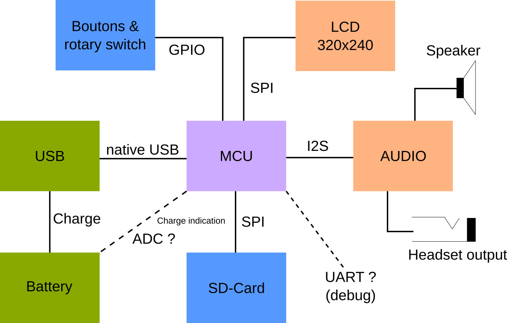

# Open Story Teller (OST)

Open Story Teller is an Open Source project to provide guidelines and software to build your own story teller box. 

The main goal is to *not* make electronics boards but instead buy or reuse existing ones. This will allow you to easily repair your device with spare parts and avoid 

We propose a set of parts and firmware that is working well togather but your are free to custom everything to fit your needs.

*DO NOT CREATE YOUR OWN BOARD, JUST USE EXISTING ONES!*

This project can be used as a base platform for any device that is composed by:
- A display (TFT...)
- An Audio output
- A SD card or memory
- Some Buttons / rotary encoder / potentiometer

# Firmware/software

The firmware is highly configurable and highly portable. To achieve that, it is split in multiple parts:
- The core source file, which is common to every target
- the ports, dedicated to an embedded MCU and board
- The tests, to easily test part of source on a standard PC
- A desktop/mobile implementation

The core is written in pure C, targets implementations may add other languages and libraries (QML/C++/python ...).

## GCC build system

The project uses CMake as build system. For the embedded targets, the main CMakeLists.txt includes a generic cross compiler file that should be good for many configurations as soon as your compiler is GCC.

## Invocation

1. Create a build directory (mkdir build)
2. Invoke cmake with some options, passed as definitions for CMake (-D<option>)

| Option               | Role                                                      |
| -------------------- | --------------------------------------------------------- |
| TOOLCHAIN            | specify the prefix name of the cross GCC binary           |
| CMAKE_TOOLCHAIN_FILE | Includes before everything else a compiler toolchain file |
| CMAKE_BUILD_TYPE     | Debug or Release (default ?)                              |
| OST_BUNDLE           | Specify the bundle name to build                          |
| TOOLCHAIN_DIR        | Specify a directory for the cross-gcc toolchain location  |


Example: `cmake -DTOOLCHAIN=riscv64-unknown-elf -DCMAKE_TOOLCHAIN_FILE=cmake/cross-gcc.cmake  -DCMAKE_BUILD_TYPE=Debug -DOST_BUNDLE=LONGAN_NANO ..`


# Hardware bundles

Here is a list of currently supported bundles. A bundle is a collection of electronics boards that are supported by official firmware builds.

Keep in mind that the official bundles proposed are not "cost-optimized". There are many rooms of improvements. The best bundles are marked with three stars "***": parts are easy to buy and the cost is minimal.

The goal of official bundles is to test the firmware on very different kind of hardware to make sure that the core firmware is highly portable.

The price indicated is purely informative.


## Raspberry Pico (Official DevKit!)

| Category           | Brand                          | Reference             | Aproximate Price |
| ------------------ | ------------------------------ | --------------------- | ---------------- |
| Main CPU board     | Rasperry Pico                  | MKR Zero              | 30€              |
| Audio              |                                |                       | 15€              |
| Memory storage     | SD card slot on board          |                       | -                |
| Battery management | Included LiPo charger on board |                       | -                |
| Display            | NewHaven  2.4" TFT             | NHD-2.4-240320CF-BSXV | 22€              |

### Install build tools

Install build tools, example for a Debian based operating system:

- sudo apt install gcc-arm-none-eabi
- sudo apt install picolibc-arm-none-eabi

Download the pico SDK somewhere on your disk:

```
git clone https://github.com/raspberrypi/pico-sdk
```


### How to build

Copy past the following command line, execute at the directory root. Replace the PICO_SDK_PATH value with the real location on your disk where you have installed the Pico SDK.

First, create a CMake build directory:

```
mkdir build
cd build
```
Then generate the makefile (we use the Pico toolchain here, so there is no specific toolchain file to setup.)

```
cmake  -DCMAKE_BUILD_TYPE=Debug -DOST_BUNDLE=RASPI_PICO -DPICO_SDK_PATH=../pico-sdk -DPICO_BOARD=pico_w ..
```

This assume that the Pico SDK is located on the git project root directory. Change this path according to your real Pico SDK location.


## Sipeed Longan Nano (GD32VF103CBT6)

| Category           | Maker                                | Name        | Rounded Price |
| ------------------ | ------------------------------------ | ----------- | ------------- |
| Main CPU board     | Sipeed                               | Longan Nano | 4€            |
| Audio              |                                      |             | 15€           |
| Memory storage     | Included SD card slot in Longan Nano |             | -             |
| Battery management |                                      |             | 15€           |

### How to build

Tools for a Debian based distro

- sudo apt install crossbuild-essential-riscv64
- sudo apt install picolibc-riscv64-unknown-elf
  
mkdir build
cd build
cmake -DTOOLCHAIN=riscv64-unknown-elf -DCMAKE_TOOLCHAIN_FILE=cmake/cross-gcc.cmake  -DCMAKE_BUILD_TYPE=Debug -DOST_BUNDLE=LONGAN_NANO ..

Convert tools:

- riscv64-unknown-elf-objcopy -O binary your-file.elf your-file.hex
- riscv64-unknown-elf-objcopy -O ihex your-file.elf your-file.hex

### Wiring

TBD

## Arduino MKR Zero (SAMD21G18A)

| Category           | Maker                          | Name                  | Rounded Price |
| ------------------ | ------------------------------ | --------------------- | ------------- |
| Main CPU board     | Arduino                        | MKR Zero              | 30€           |
| Audio              |                                |                       | 15€           |
| Memory storage     | Included SD card slot on board |                       | -             |
| Battery management | Included LiPo charger on board |                       | -             |
| Display            | NewHaven  2.4" TFT             | NHD-2.4-240320CF-BSXV | 22€           |

### How to build

Install on Ubuntu : 
- sudo apt install gcc-arm-none-eabi
- sudo apt install picolibc-arm-none-eabi

cmake -DTOOLCHAIN=arm-none-eabi -DCMAKE_TOOLCHAIN_FILE=cmake/cross-gcc.cmake  -DCMAKE_BUILD_TYPE=Debug -DOST_BUNDLE=MKR_ZERO ..

### Wiring

TBD

# Mechanical and enclosure

Use existing enclosures, build your own using wood or 3D printing... we do not propose (yet) any standard package, sorry :(

# Future targets

- ESP32 (low cost and  high availability)
- RP2040


# How to build a custom Open Story Teller box

## What is a Story Teller box?

It is a little electronics device that tells stories, mainly for children. A tiny LCD screen is used only to perform choices and create some variants of the stories.

## Architecture overview

Basically, it is a portable sound device that plays mp3 and sometimes displays an image. Here is the diagram :



## Goal

The goal of this project is to help you build your own Open Story Teller box with **existing boards**. I do not plan to build any custom board. This is because :
1. You can re-use old boards
2. You avoid wastes
3. It is relatively cheap (only if you reuse spare parts)
4. It is repairable

## Bill of materials

- A microcontroller unit board
- A rechargable battery board
- A LCD screen (320x240)
- An audio board
- Rotary switches, push buttons
- A Speaker
- A SD-Card connector
- Enclosure (wood, 3D printer-based...)
- Finally, a suitable firmware

Depending of your hardware choice, the provided firmware should be updated. The goal of this projet is to support a **selection of boards**.

# Prototype, code-name OST-1

## Presentation

For this first step, we will deliver a working prototype so that we will have a firmware to work on. This step will give us a lot of knownledge for the next step. For now, there is no price optimization. 

Technology choices are :

| Part | Price | Shop |
| --- | --- | --- |
| PCM5102 Audio board | 4 € | Aliexpress |
| PAM8302 Mono Amplifier | 9 € | Adafruit |
| Longan Nano RISC-V board with SD-Card port | 4 € | Aliexpress |
| 3.2" SPI TFT Screen (320x240) with ILI9341 driver | 9 € | Aliexpress |
| Adafruit PowerBoost 500 charger | 15 € | Adafruit |
| Some Pimoroni buttons are rotary switches | 4 € | Pimoroni |
| Speaker | 4 € | Pimoroni |
| LiPo battery 500mAh | 9 € | Any |
| **TOTAL** | **58 €** |

/!\ Achtung /!\ We can easily lower some prices, especially if your MCU controller already contains a battery connector. Remember, this first step is to test various parts.

## What does it look like

The firmware is still under construction. Everything is tested on breadboard.


What is working:
- The audio path
- The SD Card
- Roughly: playing a wav file from the SD Card

## Audio path

An I2S DAC controller with a jack output :


An audio amplifier from Adafruit (2.5W, can drive a speaker between 3 ohms and 8 ohms).


A speaker :


