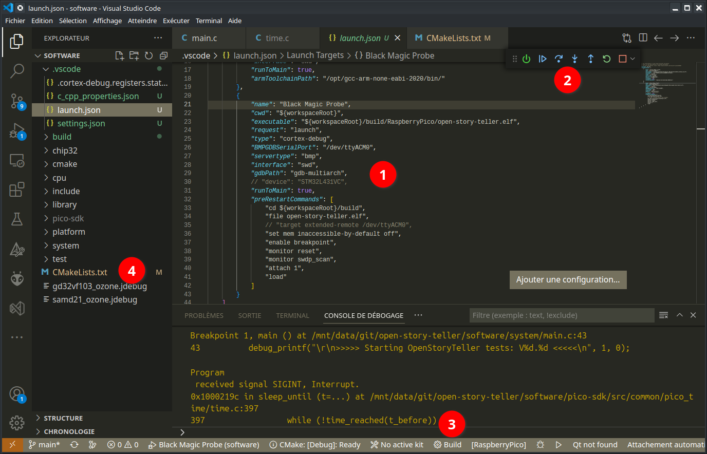

# Software development

## Shared files

The firmware is highly configurable and highly portable. To achieve that, it is split in multiple parts:
- The core source files, which are common to every target, especially the Virtual Machine
- the ports, dedicated to an embedded MCU and board
- The tests, to easily test part of source on a standard PC
- A desktop/mobile implementation

The core is written in pure C, targets implementations may add other languages and libraries (QML/C++/python ...).

## Software projects

- The Story Editor project is located in `story-editor` directory, it is programmed in C++ and uses the Qt library
- The multi-platform software player is located in `story-player`, it is programmed in C and uses the Raylib library
## Firmware project

Only one CMakeLists.txt project file is used to build all the official bundles.

# Firmware build system

The project uses CMake as build system. For the embedded targets, the main CMakeLists.txt includes a generic cross compiler file that should be good for many configurations as soon as your compiler is GCC.

The CMake file is located in `software` directory.

## Command line invocation

1. Create a build directory (mkdir build)
2. Invoke cmake with some options, passed as definitions for CMake (-Doption)

| Option               | Role                                                      |
| -------------------- | --------------------------------------------------------- |
| TOOLCHAIN            | specify the prefix name of the cross GCC binary           |
| CMAKE_TOOLCHAIN_FILE | Includes before everything else a compiler toolchain file |
| CMAKE_BUILD_TYPE     | Debug or Release (default ?)                              |
| OST_BUNDLE           | Specify the bundle name to build                          |
| TOOLCHAIN_DIR        | Specify a directory for the cross-gcc toolchain location  |

Example: `cmake -DTOOLCHAIN=riscv64-unknown-elf -DCMAKE_TOOLCHAIN_FILE=cmake/cross-gcc.cmake  -DCMAKE_BUILD_TYPE=Debug -DOST_BUNDLE=LONGAN_NANO ..`

The most important option is OST_BUNDLE which defines the hardware target.

## IDE Developement

You can use any C++ editor you want but we provide a ready to use and debug configuration for Visual Studio Code.

Recommanded plugins are:
- Microsoft C/C++ Extension Pack
- Microsoft CMake tools
- Cortex-Debug

With VSCode, open the directory `software` as root of your tree view.

1. We provide a ready to use JTAG probe configurations in the launch.json file
2. Debug with the tool at the top
3. Build shortcut!
4. CMakeLists.txt must be located at the root of your tree view.

## Debugging

To debug embedded targets, we usually connect a hardware probe between the computer and the processor. We suggest to use the following probes which are supported by our scripts:
- Segger JLink (great performance) for ARM and RISC-V cores
- Black-Magic Probe (embeds a GDB server, native debugging with GDB)
