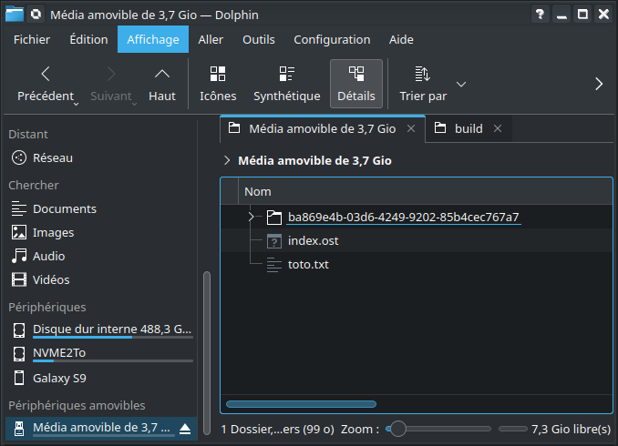

# Stories architecture
## Story location

The stories are located on a SD-Card flash memory. The following file system formats are supported by openStoryTeller:

- FAT32
- exFAT

Connect OpenStoryTeller to your computer using a USB cable, a USB-disk will show up on your file explorer.

## Story root tree

A typical folder organisation is showed here:

At the root of the SD-Card, a special index file named `index.ost` must be present. It contains the list of installed stories as well as other informations about each story.

## Story folder organisation

A story folder name must be a UUID v4 string.

It must contains:
- A project file in JSON named `project.json`
- A pre-compiled story binary name `story.c32`
- A directory named `assets`

The assets directory must contains all the resource files for the story (sounds, images...).

# Index file format

## General principle

This binary file is encoded using a simple TLV format (Type Lenght Value) supporting the following types:

| Type  | encoding |
| ----- | ----- |
| Object | 0xE7   |
|  Array | 0xAB   |
|  String |  0x3D  |
|  Integer |  0x77  |
|  Real |  0xB8  |

Each Type is encoded on a byte.

The Length is encoded on two bytes, little endian. The length indicates the size of the Value.

## Application on the Index File Forma

- Array
   - Object
      - String (UUID, folder name of the story)
      - String (title image file name)
      - String (sound title file name)

