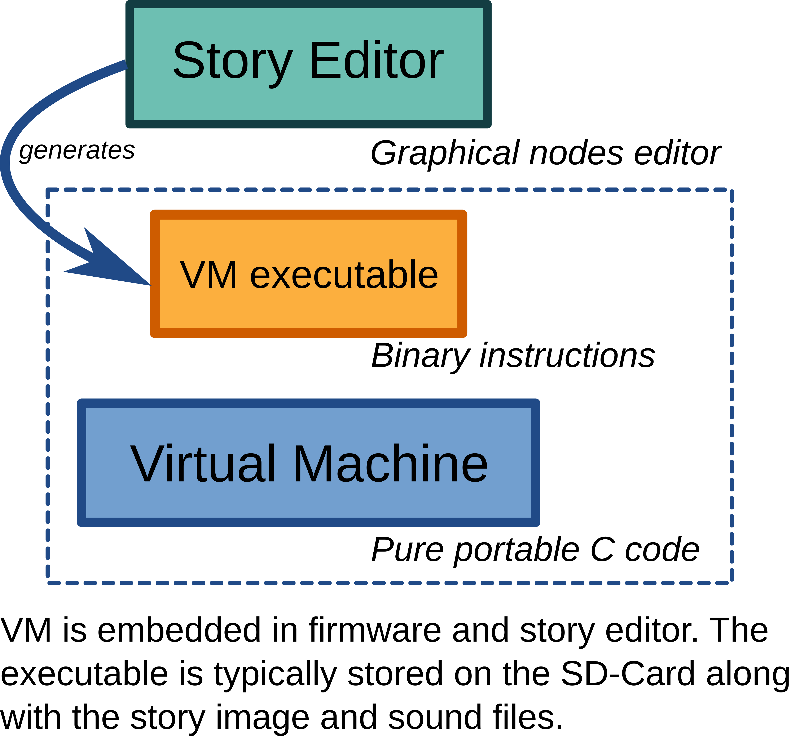

# Story Editor development

## Source code location

The source code is available in the OpenStory Teller mono-repository [Github](https://github.com/arabine/open-story-teller).

The source code is found in the *story-editor* sub-directory. 

## Development tools

You'll need:

- Qt6.x development files
- Inno-setup (to generate the Windows installer)

## How to build

Open the CMakeLists.txt with your favorite IDE (ie, QtCreator) or build from the command line.

# Architecture

