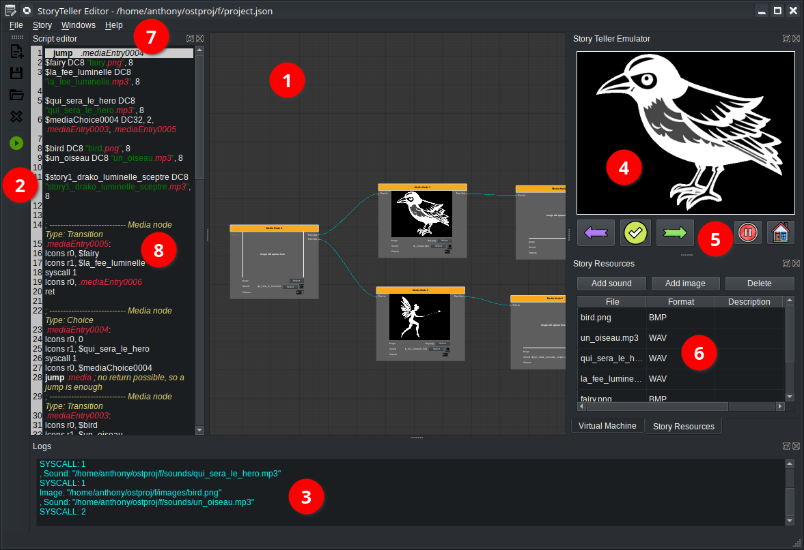
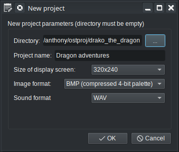

# Story Editor

The OpenStory Teller is a graphical editor based on nodes programming. It uses underneath a virtual machine and thus allows generate complex stories with branching, variable, randomization etc.

The software is programmed in C++ with the Qt library and is available on all platforms supported by Qt (3 majors operating systems).

## Main interface

The Story Editor is a desktop application with multiple dock windows. Some of them are not shown by default (developer's oriented windows).

Here is a basic description of the main interface:

1. Main graphical node editor, put nodes and link them
2. Project toolbar (open/save/close/run). The Green round arrow is used to run the story.
3. Output log window, displays informations and errors
4. Story device screen output
5. Story device input controls (previous/next/ok/pause/home buttons)
6. Resources manager (images and sounds)
7. Main menu (other docks can be triggered here)

## New project dialog

To create a new project, click on the file menu entry or the toolbar button. Fill the following dialog:

- Project directory must be empty
- Project name cannot be empty

The other options can be changed after if needed.

