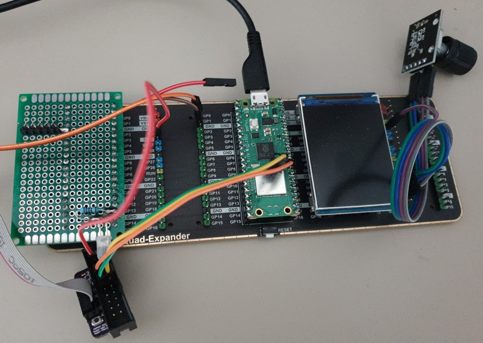
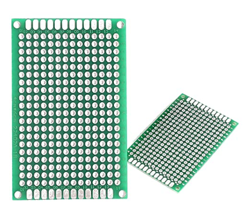

# Development kit: Raspberry Pico

This is the official development kit. It offers the following advantages:
1. Low cost
2. Parts are easy to find
3. Low wiring/soldering: usage of a motherboard 
4. SWD debug port

Current status: ON DEVELOPMENT




## Bill of materials

Here is an example of components.
- Links are examples of what to buy, price is not optimized
- Use traditional suppliers for generic components (buttons, resistors...), such as Adafruit, PiHut, Pimoroni, Kubii, Gotronic...

| Part                                  | Price    | Shop      | Link                                     |
| ------------------------------------- | -------- | --------- | ---------------------------------------- |
| Audio board + speaker                 | 13 €     | Waveshare | [Buy on Amazon](https://amzn.to/41nWgeB) |
| Raspberry Pico W                      | 9 €      | Kubii     | [Buy on Amazon](https://amzn.to/3AUQeXQ) |
| 2inch LCD  (320x240)                  | 14 €     | Waveshare | [Buy on Amazon](https://amzn.to/3LyG5oJ) |
| Some push buttons and rotary switches | 4 €      | Any       | [Buy on Amazon](https://amzn.to/3AX6MOX) |
| UPS module or Pimoroni LiPo Shim      | 15 €     | Waveshare | [Buy on Amazon](https://amzn.to/44p8Exo) |
| LiPo battery 500mAh                   | 9 €      | Any       | [Buy on Amazon](https://amzn.to/3VCl3df) |
| GPIO Expander Pico 4 modules          | 17 €     | Waveshare | [Buy on Amazon](https://amzn.to/42ukJQ4) |
| SDCard breakout board                 | 5 €      | Any       | [Buy on Amazon](https://amzn.to/3qf3chr) |  |
| **TOTAL**                             | **86 €** |


A much more optimization of price is possible using the Marble Pico board which is completely compatible to the original Pico pinout but with embedded battery management and SDCard holder. Price is still low: 5€!

| Part                                  | Price    | Shop      | Link                                                                    |
| ------------------------------------- | -------- | --------- | ----------------------------------------------------------------------- |
| Audio board + speaker                 | 13 €     | Waveshare | [Buy on Amazon](https://amzn.to/41nWgeB)                                |
| Marble Pico                           | 5 €      | ArduShop  | [Buy on ardushop.ro](https://ardushop.ro/en/home/2652-marble-pico.html) |
| 2inch LCD  (320x240)                  | 14 €     | Waveshare | [Buy on Amazon](https://amzn.to/3LyG5oJ)                                |
| Some push buttons and rotary switches | 4 €      | Any       | [Buy on Amazon](https://amzn.to/3AX6MOX)                                |
| LiPo battery 500mAh                   | 9 €      | Any       | [Buy on Amazon](https://amzn.to/3VCl3df)                                |
| GPIO Expander Pico 2 modules          | 14 €     | Waveshare | [Buy on Amazon](https://amzn.to/42ukJQ4)                                |
| **TOTAL**                             | **59 €** |


In addition to this list, you may need some more materials such as wires, prototype boards, resistors...

We may propose in the future a PCB to help the connection without soldering.




# Developers: how to build from the source code

## Clone the repository

```
git clone https://github.com/arabine/open-story-teller
```

## Install build tools

Install build tools, example for a Debian based operating system:

- sudo apt install gcc-arm-none-eabi
- sudo apt install picolibc-arm-none-eabi

Make sure that CMake will use this cross toolchain. If not, use the following option in the command line during cmake invocation.

```
cmake -DTOOLCHAIN=arm-none-eabi -DCMAKE_TOOLCHAIN_FILE=cmake/cross-gcc.cmake
```

Clone the pico SDK inside the `software` directory:

```
cd software
git clone https://github.com/raspberrypi/pico-sdk
```

If you already have the Pico SDK installed somewhere else on your disk, you can create a link. Then, create a build directory and launch the build:

```
mkdir build
cd build
cmake ..
make
```

## CMake tuning options

```
cmake  -DCMAKE_BUILD_TYPE=Debug -DOST_BUNDLE=RASPI_PICO -DPICO_SDK_PATH=../pico-sdk -DPICO_BOARD=pico_w ..
```

Replace the PICO_SDK_PATH value according to your real Pico SDK location if necessary.


