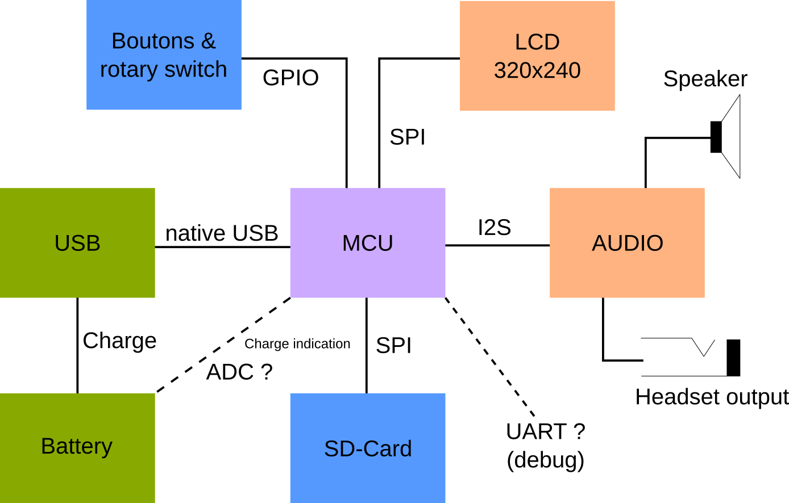

# Hardware bundles

A bundle is a collection of electronics boards that are supported by official firmware builds. They are tested and a pre-build binary is availbale to direct download.

Keep in mind that the official bundles proposed are not "cost-optimized" or sometimes difficult to buy. There are many rooms of improvements.

The goal of official bundles is to test the firmware on very different kind of hardware to make sure that the core firmware is highly portable.

The price indicated is purely informative.

## Hardware architecture overview

Basically, it is a portable sound device that plays sound files and sometimes displays an image. Here is the diagram :

