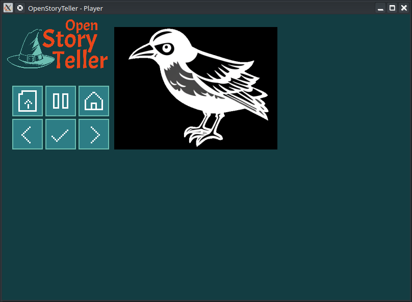

# Software player

The Story Player is a minimal implementation of OpenStoryTeller in puerely software (without hardware device)



Technolologies used:
- C language
- Raylib for graphics and sounds
- CMake build system

It should be possible to run it everywhere where Raylib can run.

# How to use

Just open the C32 Virtual Machine binary file ("story.c32", typically), images and sounds must follow standard project organisation.

## How to build for Desktop

The source code is available in the `story-player` sub-directory. From the command line:

```
mkdir build
cmake ..
make
```

## How to build for Android

The source code is available in the `story-player` sub-directory.

First, make sure the Android SDK is found:

```
export ANDROID_HOME=/mnt/work/android-sdk
```

Then, use the gradle script to build:

```
./gradlew assembleDebug
```

Finally, install the generated APK on your device:

```
adb -s a19a2a install -r app/build/outputs/apk/debug/app-debug-V1-20240503.apk
```

Comments:
- Change the option `-s a19a2a` with the corresponding device ID you are using. See it using `adb devices` to see connected phones.
- `app-debug-V1-20240503.apk` is the APK name containing the date of the build. Use the APK generated in this directory.


## TODO

1. Drag and drop zipped story archive
2. Stories library manager


